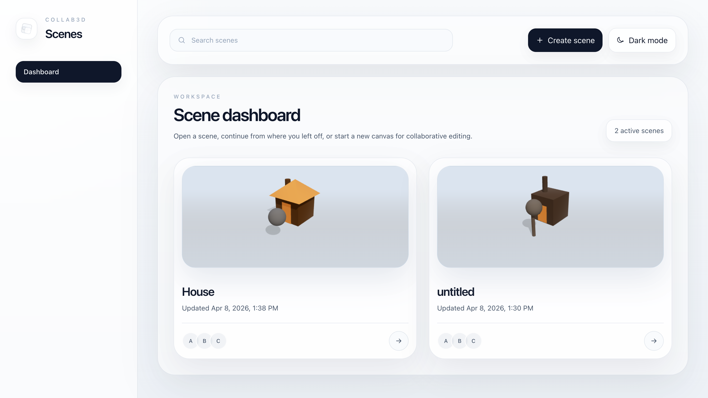

# Collab3D

[Live App](https://threed-collab-app-1.onrender.com/)



## Description

Collab3D is a browser-based collaborative 3D scene editor where multiple users can create and edit the same scene in real time.

The project combines a React-based 3D editor with an ASP.NET Core backend, SignalR-powered live synchronization, and PostgreSQL persistence. It was built to explore shared state, realtime collaboration, interactive 3D tooling in the browser, and full-stack deployment.

## Highlights

- Real-time multi-user scene editing with SignalR
- Shared collaborator presence and live selection indicators
- 3D object creation, transform controls, and material editing
- Undo and redo support for scene changes
- Persistent scene storage with PostgreSQL and Entity Framework Core
- Dashboard with rendered scene thumbnails
- Deployed full-stack application with separate frontend, backend, and database services

## Tech Stack

- Frontend: React, TypeScript, Vite, React Three Fiber, Three.js, Drei
- Backend: C#, ASP.NET Core, SignalR
- Data: PostgreSQL, Entity Framework Core
- Infrastructure: Docker, Docker Compose, Nginx, Render

## Run Locally

```bash
docker compose up --build
```
